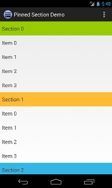
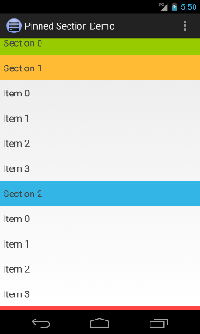

Introduction
============

Easy to use ListView with pinned sections for Android. Pinned section is a header view which sticks to the top
of the list until at least one item of that section is visible.

&nbsp;
&nbsp;

Features
========
This list properly implements many features which are missing from other implementations. These are
 * Fast scroll
 * Headers and footers
 * Clickable pinned sections

Besides this it doesn't create any unnecessary views, layouts etc. It's really lean.

Watch [this video][1] to see `PinnedSectionListView` in action.

Usage
=====
 1. Replace standard `ListView` with `com.hb.views.PinnedSectionListView` in your `layout.xml` file.

        <com.hb.views.PinnedSectionListView
            android:id="@android:id/list"
            android:layout_width="match_parent"
            android:layout_height="wrap_content" 
            />
  
 2. Extend your `ListAdapter` in a way that it implements `PinnedSectionListAdapter` interface, in addition to
    what it already implements. Basically you need to add a single `isItemViewTypePinned(int viewType)` 
    method. This method must return `true` for all view types which have to be pinned.

        // Our adapter class implements 'PinnedSectionListAdapter' interface
        class MyPinnedSectionListAdapter extends BaseAdapter implements PinnedSectionListAdapter {
        
             ...
           
             // We implement this method to return 'true' for all view types we want to pin
             @Override
             public boolean isItemViewTypePinned(int viewType) {
                 return viewType == <type to be pinned>;
             }
        }

That's all. You are done! A working example can also be found in `example` folder. 

Used by
=======
Let us know if you use this library in your application and we will mention it here.

[Grocery Sum][2]

License
=======

    Copyright 2013 Sergej Shafarenka, halfbit.de

    Licensed under the Apache License, Version 2.0 (the "License");
    you may not use this file except in compliance with the License.
    You may obtain a copy of the License at

       http://www.apache.org/licenses/LICENSE-2.0

    Unless required by applicable law or agreed to in writing, software
    distributed under the License is distributed on an "AS IS" BASIS,
    WITHOUT WARRANTIES OR CONDITIONS OF ANY KIND, either express or implied.
    See the License for the specific language governing permissions and
    limitations under the License.

[1]: http://www.youtube.com/watch?v=mI3DpuoIIhQ
[2]: https://play.google.com/store/apps/details?id=org.codechimp.grocerysum
